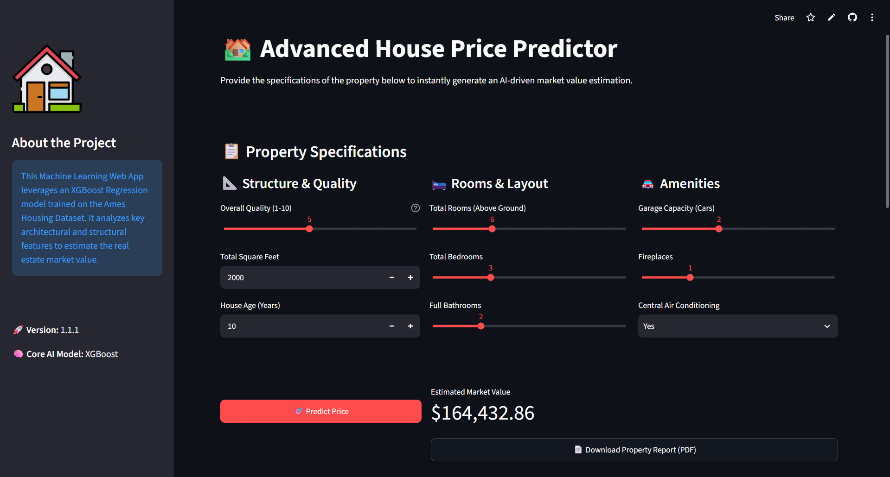
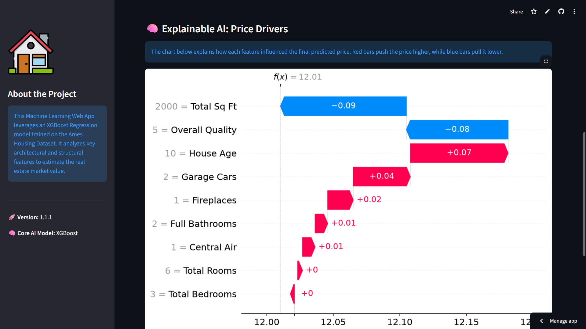
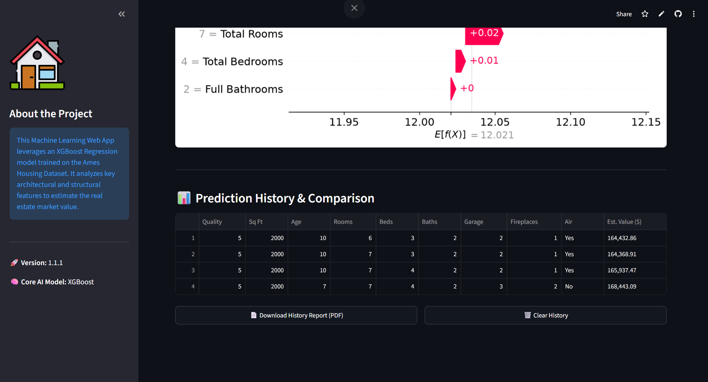
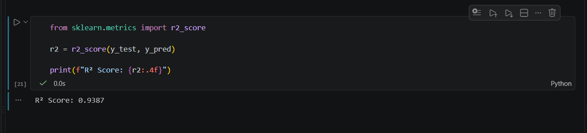

# 🏡 Advanced House Price Predictor

An end-to-end Machine Learning web application designed to predict residential property market values accurately. Built with **XGBoost**, **Streamlit**, **SHAP (Explainable AI)**, and **FPDF2**, this project bridges the gap between predictive modeling, transparent AI, and user-centric software design.

🔗 **Live App Demo:** [Streamlit Live App](https://advanced-house-price-predictor-bh8a79nkckhpywwr2qglch.streamlit.app/)  
💻 **GitHub Repository:** [Advanced-House-Price-Predictor](https://github.com/tharusha0010/Advanced-House-Price-Predictor.git)

---

## 📸 App Preview

### 1. Interactive Property Specifications Dashboard

*A clean and intuitive user interface allowing users to input property specifications and instantly generate an estimated market value, complete with a downloadable PDF report.*

### 2. Explainable AI: Price Drivers

*Integrated Explainable AI (XAI) using SHAP waterfall plots to transparently visualize how each architectural feature positively or negatively influences the final predicted price.*

### 3. Prediction History & Comparison Table

*An interactive session-state table that tracks multiple property evaluations side-by-side, allowing users to easily compare different properties and export the complete history as a professional PDF.*

### 4. High-Accuracy Model Performance

*A snippet from the data science notebook demonstrating the XGBoost model's accuracy. The model achieved an outstanding **R² Score of 0.9387** on the unseen test dataset, indicating high predictive reliability.*

---

## 🚀 Key Features

* **Core AI Model:** Powered by an optimized **XGBoost Regressor** trained on the comprehensive Ames Housing Dataset, achieving an exceptional **$R^2$ Score of 0.9387** on test data.
* **Explainable AI (XAI):** Integrated **SHAP waterfall plots** to dynamically show how specific architectural features (such as square footage and overall quality) drive the final valuation up or down.
* **Prediction History & Comparison Table:** Utilizes Streamlit's `session_state` to let users track multiple property evaluations side-by-side in a clean, interactive comparison table.
* **PDF Report Generation:** Allows users to instantly export professional PDF valuation reports for both individual property predictions and the complete prediction history table.
* **Smart Input Validation:** Implements automated sanity checks to flag unrealistic property configurations and prevent prediction errors.
* **Responsive UI:** Clean, multi-column dashboard layout built completely with Streamlit.

---

## 🛠️ Tech Stack

* **Language:** Python
* **Machine Learning & Modeling:** XGBoost, Scikit-Learn, SHAP, NumPy, Pandas, Joblib
* **Web Framework:** Streamlit
* **PDF Generation:** FPDF2
* **Visualization:** Matplotlib, Seaborn
* **Version Control:** Git & GitHub

---

## 📂 Project Structure

```text
Advanced-House-Price-Predictor/
│
├── data/
│   └── AmesHousing.csv              # Raw dataset used for training
├── images/
│   ├── preview_01.png               # App dashboard screenshot
│   ├── preview_02.png               # SHAP explanation screenshot
│   └── preview_03.png               # History table screenshot
├── notebooks/
│   ├── 01_eda_and_preprocessing.ipynb # Exploratory Data Analysis and training notebook
│   └── web_model.pkl                # Serialized trained XGBoost model
├── app.py                           # Main Streamlit web application script
├── requirements.txt                 # Python dependencies (including fpdf2)
└── README.md                        # Project documentation

```

---

## ⚙️ Installation & Local Setup

Follow these steps to set up and run the project locally on your machine:

1. **Clone the Repository:**
```bash
git clone [https://github.com/tharusha0010/Advanced-House-Price-Predictor.git](https://github.com/tharusha0010/Advanced-House-Price-Predictor.git)
cd Advanced-House-Price-Predictor

```


2. **Create and Activate a Virtual Environment:**
```bash
python -m venv venv
# On Windows:
venv\Scripts\activate
# On macOS/Linux:
source venv/bin/activate

```


3. **Install Dependencies:**
```bash
pip install -r requirements.txt

```


4. **Run the Streamlit App:**
```bash
streamlit run app.py

```


---

## 💡 What I Learned

* **Model Evaluation & Performance:** Learned how to evaluate regression models effectively using the $R^2$ score, validating high predictive accuracy ($0.9387$) on unseen test data.
* **Handling Model Extrapolation:** Gained deeper insight into how tree-based models (like XGBoost) behave beyond training data boundaries and how features handle extreme inputs.
* **Making Black-Box Models Transparent:** Successfully integrated SHAP values to transform complex model predictions into interpretable visual explanations for everyday users.
* **Document Generation in Python:** Implemented dynamic PDF document generation (`fpdf2`) for downloadable reports and multi-row summary tables.
* **Full-Stack ML Deployment:** Managed the end-to-end pipeline from data cleaning and model serialization to cloud deployment and state management (`session_state`) in Streamlit.

---

## 👤 Author

**Tharusha Ariyarathna**

```